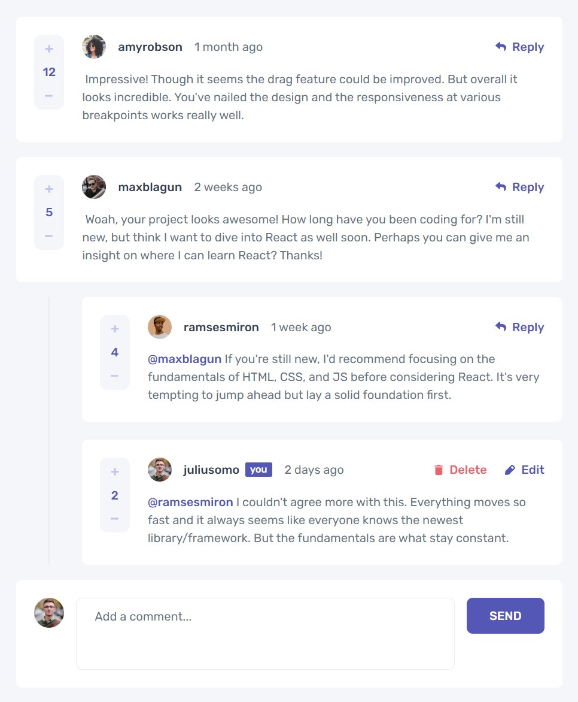
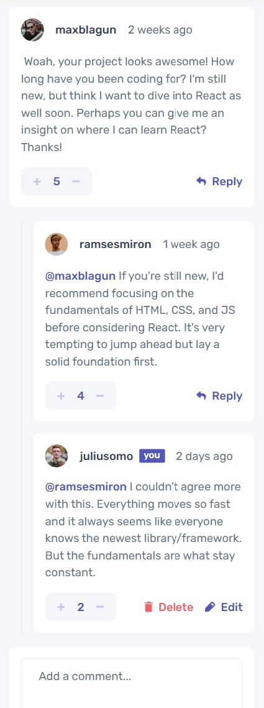

# Frontend Mentor - Interactive comments section solution

This is a solution to the [Interactive comments section challenge on Frontend Mentor](https://www.frontendmentor.io/challenges/interactive-comments-section-iG1RugEG9). Frontend Mentor challenges help you improve your coding skills by building realistic projects. 

### Links

- Solution URL: https://github.com/aaronrubinstein/interactive-comments-section
- Live Site URL: https://aaronrubinstein.github.io/interactive-comments-section/

### Screenshot

**Desktop**

**Mobile**

